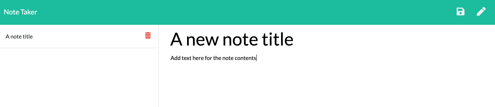

# Note-Taker

An application that uses Node.js and Express to write, save, and delete notes.

Deployed application link: https://stormy-waters-66331.herokuapp.com/ 

## Usage

### Node.js

Node.js is used to execute Javascript code to run the server.

### Express

Express is used as a framework to build the back-end and allow the client to connect to the server.

### Heroku

The live application is deployed on Heroku.

## Preview

See below for a preview of what the application looks like:

